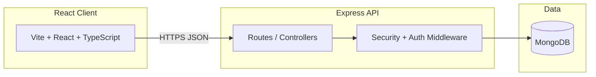

# System architecture

**Application:** [SUNi-Make-Your-Day-Shining](https://github.com/LouisLi1020/SUNi-Make-Your-Day-Shining)

## Layers

| Layer | Technology | Responsibility |
|-------|------------|----------------|
| Presentation | React 18, Tailwind, Zustand | Storefront UI, admin pages |
| API | Express, TypeScript | Auth, products, cart, checkout |
| Security | Middleware + JWT | Validation, rate limits, roles |
| Persistence | Mongoose / MongoDB | Users, products, orders |

## Design trade-off (interview note)

**Monolithic Express API** vs microservices: chosen for a solo side project and fast iteration. Under load, first steps would be stateless API replicas, managed MongoDB, and CDN for static assets — not premature service splits.
