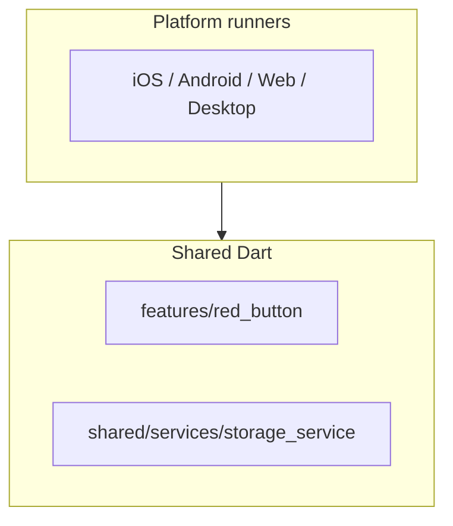

# Multi-platform architecture — REBO

**Application:** [REBO](https://github.com/LouisLi1020/REBO)

## Purpose

REBO is a minimal Flutter app (red button, score, haptics) used to practice **cross-platform client architecture** alongside server-side work on SUNishop and CAKE.

## Platform targets

| Platform | Folder | Notes |
|----------|--------|--------|
| iOS | `ios/` | Flutter embedder |
| Android | `android/` | Shared Dart codebase |
| Web | `web/` | Canvas / PWA-capable |
| Windows | `windows/` | Desktop runner |
| macOS | `macos/` | Desktop runner |
| Linux | `linux/` | Desktop runner |

## Structure

## Trade-offs

1. **Flutter vs native** — One codebase for six targets; trade-off is binary size and occasional platform-specific polish.
2. **Feature folders** — `lib/features/` scales to roadmap items (`dual_button`, `food_decider`) without a flat screen tree.
3. **Local storage** — `storage_service` abstracts high scores; can evolve to secure storage per platform.

## Status

Phase 1 (red button + persistence) is in the main repo. This document supports architecture narrative; it does not imply all stores are published.
